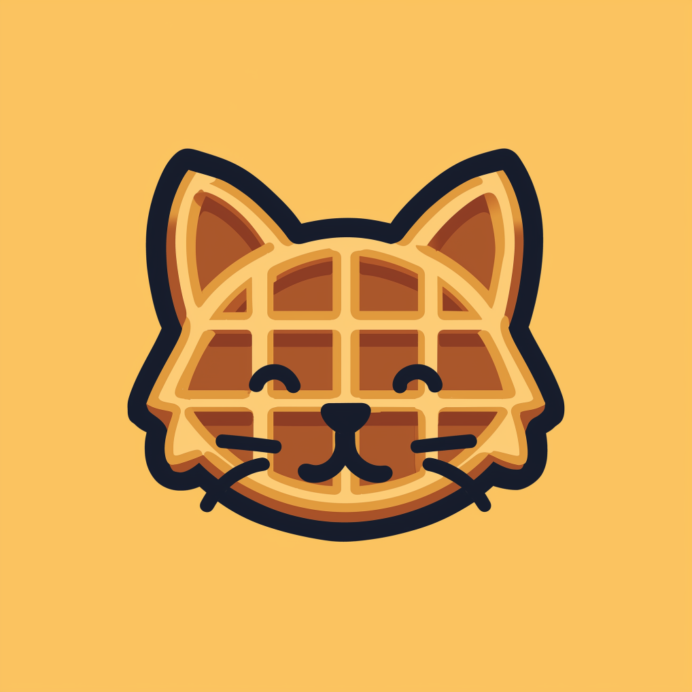
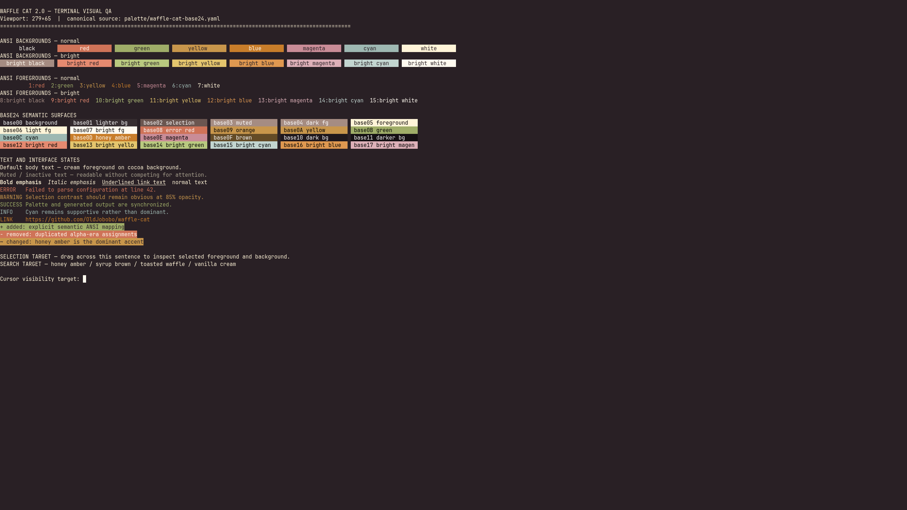
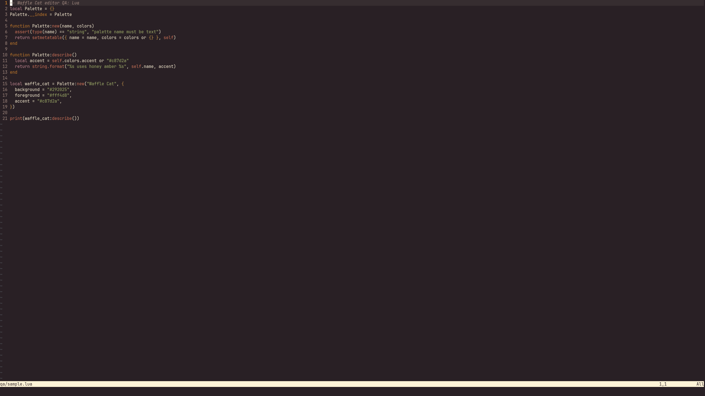
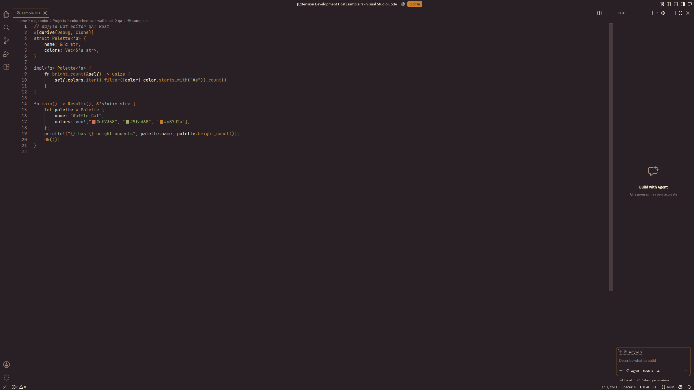

# Waffle Cat

<p align="center">
  
</p>

Waffle Cat is a warm, mature daily-driver colorscheme built from syrup brown,
coffee, toasted waffle, honey amber, vanilla cream, and restrained support
colors. Version 2.0 replaces the alpha palette with the color system developed
for the completed [Omarchy Waffle Cat theme][omarchy-theme].

Honey amber is the dominant accent. Error red, pistachio green, porcelain cyan,
and strawberry magenta remain distinct without competing for attention.

## Preview

| Terminal palette | Neovim | VS Code |
|---|---|---|
|  |  |  |

Additional terminal and opacity captures are available in [`screenshots/`](screenshots/).
The recorded review results are in [`screenshots/QA.md`](screenshots/QA.md).

## Palette

[`palette/waffle-cat-base24.yaml`](palette/waffle-cat-base24.yaml) is the
canonical portable palette. Base24 retains the authored bright ANSI colors and
the extended dark background ramp. The Base16 file is a deliberate reduction
for consumers that only understand sixteen slots.

| Role | Color | Hex |
|---|---:|---|
| Background | <span style="color:#292025">■</span> | `#292025` |
| Foreground | <span style="color:#fff4d8">■</span> | `#fff4d8` |
| Honey amber | <span style="color:#c87d2a">■</span> | `#c87d2a` |
| Error red | <span style="color:#cf7358">■</span> | `#cf7358` |
| Pistachio green | <span style="color:#9fad68">■</span> | `#9fad68` |
| Toasted yellow | <span style="color:#c8964b">■</span> | `#c8964b` |
| Porcelain cyan | <span style="color:#9eb8b2">■</span> | `#9eb8b2` |
| Strawberry magenta | <span style="color:#c98c97">■</span> | `#c98c97` |
| Syrup brown | <span style="color:#644b26">■</span> | `#644b26` |

## Included targets

### Terminals

- Alacritty
- Foot
- Ghostty
- Kitty
- WezTerm
- Warp

### Editors

- Standalone Neovim colorscheme
- Helix
- VS Code
- Zed

### CLI tools

- tmux
- bat
- delta
- fzf

## Install

Clone the repository to a stable location:

```bash
git clone https://github.com/OldJobobo/waffle-cat.git \
  "$HOME/.local/share/waffle-cat"
```

The examples below assume that path. Replace it if you clone elsewhere.

### Alacritty

Import the generated color tables from `~/.config/alacritty/alacritty.toml`:

```toml
[general]
import = ["~/.local/share/waffle-cat/configs/alacritty.toml"]
```

### Foot

Add this at the top level of `~/.config/foot/foot.ini`:

```ini
include=~/.local/share/waffle-cat/configs/foot.ini
```

Foot requires an absolute path if tilde expansion is unavailable in your
version.

### Ghostty

Load the color fragment from `~/.config/ghostty/config`:

```ini
config-file = ~/.local/share/waffle-cat/configs/ghostty.conf
```

You can test it without changing your config:

```bash
ghostty --config-file="$HOME/.local/share/waffle-cat/configs/ghostty.conf"
```

### Kitty

Add this to `~/.config/kitty/kitty.conf`:

```conf
include ~/.local/share/waffle-cat/configs/kitty.conf
```

### WezTerm

`configs/wezterm.lua` is a complete colors-only WezTerm configuration. Use it
directly from `~/.wezterm.lua` while retaining space for local settings:

```lua
local config = dofile(os.getenv("HOME") .. "/.local/share/waffle-cat/configs/wezterm.lua")

-- Add your own font, window, key, and domain settings here.

return config
```

### Neovim

Install the standalone colorscheme:

```bash
mkdir -p "$HOME/.config/nvim/colors"
ln -sfn \
  "$HOME/.local/share/waffle-cat/colors/waffle-cat.lua" \
  "$HOME/.config/nvim/colors/waffle-cat.lua"
```

Then select it from `init.lua`:

```lua
vim.cmd.colorscheme("waffle-cat")
```

The root `neovim.lua` is an optional LazyVim selector. The standalone
colorscheme does not require LazyVim or Aether.

### Helix

```bash
mkdir -p "$HOME/.config/helix/themes"
ln -sfn \
  "$HOME/.local/share/waffle-cat/configs/helix.toml" \
  "$HOME/.config/helix/themes/waffle-cat.toml"
```

Set the theme in `~/.config/helix/config.toml`:

```toml
theme = "waffle-cat"
```

### VS Code

The repository ships a plain VS Code color-theme JSON file. For a local
extension install, create a minimal theme extension:

```bash
extension="$HOME/.vscode/extensions/oldjobobo.waffle-cat-2.0.0"
mkdir -p "$extension/themes"
cp "$HOME/.local/share/waffle-cat/configs/vscode-theme.json" \
  "$extension/themes/waffle-cat-color-theme.json"
cat > "$extension/package.json" <<'JSON'
{
  "name": "waffle-cat",
  "displayName": "Waffle Cat",
  "version": "2.0.0",
  "publisher": "oldjobobo",
  "engines": { "vscode": "^1.80.0" },
  "categories": ["Themes"],
  "contributes": {
    "themes": [
      {
        "label": "Waffle Cat",
        "uiTheme": "vs-dark",
        "path": "./themes/waffle-cat-color-theme.json"
      }
    ]
  }
}
JSON
```

Restart VS Code and select **Preferences: Color Theme → Waffle Cat**.

### Zed

```bash
mkdir -p "$HOME/.config/zed/themes"
ln -sfn \
  "$HOME/.local/share/waffle-cat/configs/zed.json" \
  "$HOME/.config/zed/themes/waffle-cat.json"
```

Select **Waffle Cat** from Zed's theme selector.

### tmux

Add this to `~/.tmux.conf`:

```tmux
source-file ~/.local/share/waffle-cat/configs/tmux.conf
```

Reload with:

```bash
tmux source-file "$HOME/.tmux.conf"
```

### bat

```bash
mkdir -p "$(bat --config-dir)/themes"
ln -sfn \
  "$HOME/.local/share/waffle-cat/configs/waffle-cat.tmTheme" \
  "$(bat --config-dir)/themes/waffle-cat.tmTheme"
bat cache --build
```

Add this to bat's config file:

```text
--theme=waffle-cat
```

### delta

Install the bat theme first, because delta uses it for syntax highlighting.
Include the generated feature from `~/.gitconfig`:

```gitconfig
[include]
    path = ~/.local/share/waffle-cat/configs/delta.gitconfig

[core]
    pager = delta

[interactive]
    diffFilter = delta --color-only

[delta]
    features = waffle-cat
```

### fzf

Source the generated POSIX shell fragment from `.bashrc`, `.zshrc`, or another
compatible shell startup file:

```bash
. "$HOME/.local/share/waffle-cat/configs/fzf.sh"
```

The fragment preserves existing `FZF_DEFAULT_OPTS` and appends Waffle Cat's
color options.

### Warp

On Linux:

```bash
warp_themes="${XDG_DATA_HOME:-$HOME/.local/share}/warp-terminal/themes"
mkdir -p "$warp_themes"
ln -sfn \
  "$HOME/.local/share/waffle-cat/configs/warp.yaml" \
  "$warp_themes/waffle-cat.yaml"
```

Restart Warp and select **Waffle Cat** under Appearance.

## Development

Generation requires Python 3.11 or newer and PyYAML.

```bash
# Regenerate every generated terminal and CLI target.
./scripts/generate-all.sh

# Validate palettes, editor exports, CLI integrations, and generated files.
./scripts/check-generated.sh

# Verify exact synchronization with the Omarchy source palette.
./scripts/validate-palettes.py \
  --source ~/Projects/themes/omarchy-waffle-cat-theme/colors.toml

# Final post-commit release gate.
./scripts/validate-release.py --require-clean
```

The generated files identify themselves in their first line and should not be
edited directly. Editor exports are intentionally maintained as portable files
but are checked so that every embedded color derives from the canonical Base24
palette.

Use the terminal QA fixture with any installed supported terminal:

```bash
./scripts/launch-terminal-qa.sh alacritty 1.0
./scripts/launch-terminal-qa.sh wezterm 0.85
```

Representative source fixtures live under [`qa/`](qa/). The complete release
gate and remaining publication steps are recorded in
[`RELEASE-CHECKLIST.md`](RELEASE-CHECKLIST.md).

## Source relationship

The completed [Omarchy Waffle Cat theme][omarchy-theme] is the visual authority
for Waffle Cat 2.0. Its `colors.toml` defines the authored semantic colors.
This repository converts that palette into portable terminal, editor, and CLI
formats.

Omarchy-specific shell, GTK, Hyprland, Waybar, wallpaper, and desktop behavior
remain in the Omarchy theme repository and are intentionally not duplicated
here.

## Versioning

Waffle Cat follows semantic versioning:

- **Patch:** corrections to mappings, documentation, or target-specific roles
  without changing the canonical palette.
- **Minor:** new portable targets or substantial highlighting coverage that
  remains palette-compatible.
- **Major:** canonical palette changes or incompatible changes to exported
  theme identity and structure.

Version 2.0 is a palette-breaking release from the alpha generation. The final
alpha state is recoverable from the `alpha-final` Git tag.

## License

Waffle Cat is available under the [MIT License](LICENSE).

## Attribution

Waffle Cat was created by [OldJobobo](https://github.com/OldJobobo). The 2.0
portable palette is derived from the completed Omarchy implementation and
preserves its authored color values.

[omarchy-theme]: https://github.com/OldJobobo/omarchy-waffle-cat-theme
